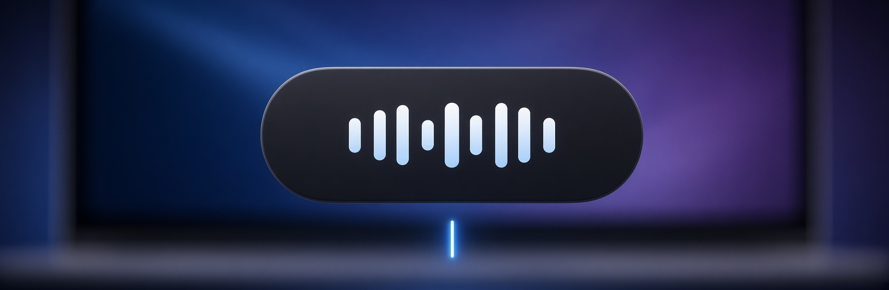
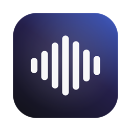
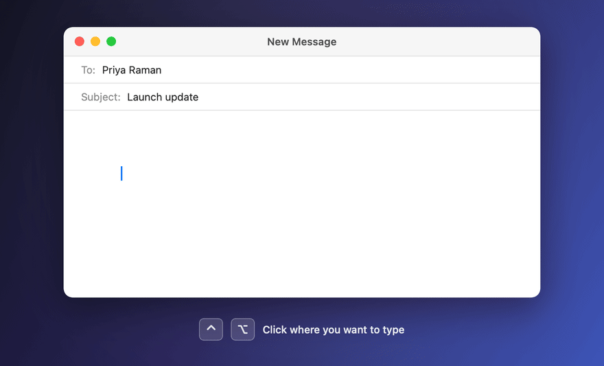

<p align="center">
  
</p>

<p align="center">
  
</p>

<h1 align="center">Openflow</h1>

<p align="center">
  <b>Speak anywhere on your Mac. Openflow types it, cleanly.</b><br>
  Native macOS dictation powered by SpaceXAI Grok models.
</p>

**Install in one line** (macOS 14+). Paste this into Terminal:

```bash
curl -fsSL https://raw.githubusercontent.com/arhamtalkstech/Openflow/main/install.sh | bash
```

It downloads the latest release, checks its checksum and code signature, installs Openflow in Applications, and opens the setup assistant, with no security prompts. Run it again any time to update.

<p align="center">
  
  
  
  
  
  
  
  
</p>

<p align="center">
  <a href="../../releases/latest"><b>Download for Mac</b></a> ·
  <a href="#getting-a-spacexai-api-key">Get an API key</a> ·
  <a href="docs/usage.md">How to use it</a> ·
  <a href="docs/architecture.md">How it works</a>
</p>

<p align="center">
  
</p>

Openflow is a native macOS menu bar app for voice dictation. Put your cursor in any text field in any app, hold a shortcut, and talk. A small bubble appears above your text cursor while you speak. When you stop, polished text is pasted where you were typing: punctuated, formatted, and written for that app.

It runs on SpaceXAI's Grok models:
- **Grok Voice Transcribe 2.0** streams speech-to-text.
- **Grok 4.3** cleans up and formats the text.

You bring your own SpaceXAI API key, and everything runs from your Mac directly against the SpaceXAI API.

## Features

- **Works in every app**: Slack, Mail, Google Docs, Notion, browsers, terminals, and anywhere else you can type.
- **Writes like you typed it.** Filler words disappear, your corrections are applied ("Monday, no wait, Tuesday" → "Tuesday"), and lists, numbers, emails, and money are formatted. The style matches the destination: emails read like emails, chat messages like chat.
- **Edit by voice.** Select text and say "make this shorter" or "turn this into bullets", and the selection is rewritten in place. Say "by the way…" and your words are added after it.
- **Any language.** Auto-detect handles mid-sentence switches and never translates unless you ask.
- **Hold to talk, or hands-free.** Hold the shortcut and release to paste, or tap it and every pause pastes.
- **Live feedback.** The bubble shows a waveform and the last few words heard, plus "No audio detected" if your mic is silent.
- **Nothing lost.** If the connection drops, Openflow keeps recording and recovers the audio, or offers **Retry**. If a paste doesn't land, it offers **Paste**.
- **Personal.** Add an About-you profile, custom instructions, and a dictionary for names and jargon.
- **Usage dashboard**: time spoken, words, keystrokes saved, latency, and exact API spend. Counts only; nothing you say is stored.
- **Choose your microphone** from the menu bar.
- **Over-the-air updates.** An Update button appears when a new version is out.

## Requirements

- macOS 14 Sonoma or later, Apple Silicon or Intel
- A SpaceXAI API key ([console.x.ai](https://console.x.ai))
- To build from source: the Swift 6 toolchain (Xcode or just the Command Line Tools)

## Getting a SpaceXAI API key

Openflow uses your own SpaceXAI API key; there is no Openflow account or server.

1. Open the **SpaceXAI Console** at [console.x.ai](https://console.x.ai) and sign in, or create an account.
2. Make sure your team can pay for API usage: add credits or a payment method in the console's billing settings.
3. Go to **API Keys** ([console.x.ai/team/default/api-keys](https://console.x.ai/team/default/api-keys)) and create a new key. Name it something you'll recognize, like "Openflow".
4. If you restrict the key to specific models or endpoints, allow:
   - **speech-to-text** with `grok-voice-transcribe-2.0`;
   - **text generation (Responses API)** with `grok-4.3`.
5. Copy the key; it starts with `xai-`. The console may show it only once.
6. Paste it into Openflow's setup assistant, or later under **API key & spend**.

Openflow then checks the key for real: it verifies the key, opens a speech-to-text connection, and makes a one-word Grok call. If the key works but can't reach one of the two models, Openflow tells you which.

**What it costs:**
- **Speech-to-text:** about $0.20 per hour of audio streamed.
- **Cleanup:** roughly $0.001–0.002 per dictation.
- **For scale:** the full 35-scenario test suite (about 5 minutes of speech) costs about $0.07.

The dashboard shows your exact spend.

**Keep it safe.** The key stays on your Mac, in the Keychain or a file only your account can read. It's never put in the app or in this repository. If a key leaks or a Mac is lost, delete the key in the console's **API Keys** page and create a new one.

## Install

**One line (recommended):**

```bash
curl -fsSL https://raw.githubusercontent.com/arhamtalkstech/Openflow/main/install.sh | bash
```

[`install.sh`](install.sh) reads the latest version from the update feed and downloads it from this project's GitHub Releases. Before installing, it verifies the SHA-256 checksum published with the release and the app's code signature. It then installs to `/Applications` (or `~/Applications` if your account can't write there), quits a running copy, and launches Openflow.
- **No security prompt:** files downloaded with `curl` aren't flagged as browser downloads, so macOS opens the app without the "unidentified developer" warning.
- **Pick a version:** `curl -fsSL …/install.sh | OPENFLOW_VERSION=1.1.2 bash`.
- **Read it first:** the script is short. Open [install.sh](install.sh) to see exactly what runs.

**From a DMG:** download the latest `Openflow-x.y.z.dmg` from this project's Releases page, open it, and drag **Openflow** to **Applications**. Release builds aren't notarized by Apple yet, so the first time you open Openflow:
1. macOS says it can't verify the developer. Click **Done**.
2. Go to **System Settings → Privacy & Security** and click **Open Anyway**.

You only do this once; updates install without it.

**From source:**

```bash
git clone <this repository> && cd Openflow
scripts/create-signing-cert.sh    # once: a local signing identity, so macOS remembers permissions across rebuilds
scripts/build-app.sh --install    # builds and installs /Applications/Openflow.app, then launches it
```

## First launch

A setup assistant walks through each step and checks that it works on your Mac:
1. **API key:** it makes a real speech-to-text connection and a Grok call.
2. **Microphone:** a live level meter, with a microphone picker.
3. **Accessibility:** needed for the global shortcut, finding the cursor, and pasting.
4. **Shortcut:** pick one or record your own.
5. **Practice dictation.**
6. **Optional profile.**
7. **Open at login.**

Run it again any time from the menu bar → **Setup assistant…**.

## Using Openflow

| Do this | What happens |
|---|---|
| Hold the shortcut, talk, release | Your words are pasted at the cursor |
| Tap the shortcut | Hands-free: every pause pastes; tap again or click ✕ to stop |
| Select text, then dictate | Instructions rewrite the selection; anything else is added after it |
| Esc | Discards what hasn't been pasted yet |
| Menu bar → Microphone | Pick the input device |
| Menu bar → Paste last dictation | Pastes your latest dictation again (kept in memory only) |

The default shortcut is **⌃ Control**. Shortcuts can be a single modifier (Right ⌥, fn), a chord (⌃⌥), or a combination (⌥Space). More in [`docs/usage.md`](docs/usage.md).

## Privacy and security

**Network access.** Openflow connects to exactly two places:
- **The SpaceXAI API (`api.x.ai`)**, only when you dictate, retry, or check a key:
  - `wss://api.x.ai/v1/stt`: streaming speech-to-text
  - `/v1/stt`: recovering a dictation after a dropped connection
  - `/v1/responses`: text cleanup
  - `/v1/api-key`: the key check
- **The update feed and its downloads (GitHub)**, once a day to check for a new version, and when you click **Update**.

There is no analytics, telemetry, crash reporting, or other third-party service, and nothing on your disk is uploaded. The console link in the setup assistant opens your browser.

**What is sent:** audio and text go straight from your Mac to the SpaceXAI API with your key. Grok sees:
- what you said;
- the destination app and field type;
- the last few words before your cursor (at most 12, never the whole field, and this can be turned off);
- text you selected yourself.

Password fields are never read.

**What is stored on your Mac:**
- usage counts;
- a log of where the bubble was placed (app IDs and coordinates only);
- your API key, in the Keychain for Developer ID builds, otherwise in a private file only your account can read.

Dictated text and audio are never written to disk.

**How the app is built:**
- **Hardened runtime.** Builds are signed with it, and only microphone access is requested.
- **Signed updates.** Every update must carry a valid EdDSA signature and the same code signature, or it is refused.

Details are in [`docs/architecture.md`](docs/architecture.md) and [`docs/distribution.md`](docs/distribution.md).

## Development

```bash
swift build                                        # debug build of the app, the core library, and the test harness
swift run openflow-cli caret-selftest              # bubble placement (no API key needed)
swift run openflow-cli spacing-selftest            # joining dictations: spacing, capitalization, punctuation
swift run openflow-cli hedge-selftest              # slow-response hedging and the content guard

export XAI_API_KEY=…                               # your SpaceXAI key, from your shell or password manager; never commit it
swift run openflow-cli suite                       # 35 real-audio scenarios (SpaceXAI TTS → streaming STT → Grok → simulated text field)
swift run openflow-cli suite --only spoken-list -v # one scenario with an engine trace
```

The suite synthesizes speech with SpaceXAI TTS and streams it in real time through the same engine the app uses. It covers corrections, lists, five languages, app-specific styles, selection edits, offline recovery, and failed pastes. The latest full run is in [`docs/sample-suite-run.txt`](docs/sample-suite-run.txt).

| Variable | Used by | What it is |
|---|---|---|
| `XAI_API_KEY` | test harness, `swift run` | Your SpaceXAI API key. The app itself stores the key you enter in the setup assistant. |
| `OPENFLOW_ENV_KEY_ONLY` | debug runs | `1` = read the key only from `XAI_API_KEY`, never from the Keychain or the key file. |

## Releasing

```bash
scripts/make-dmg.sh                         # dist/Openflow-<version>.dmg (Apple Silicon + Intel)
scripts/release.sh 1.2.0 --notes notes.md   # publish an over-the-air update (see docs/distribution.md)
```

Release settings go in `scripts/release.local.conf` (gitignored): the GitHub repository whose Releases host updates, and the `gh` account that publishes. `scripts/release.conf` documents the options. Signing for notarized builds, key backup, and local update testing are covered in [`docs/distribution.md`](docs/distribution.md).

## Project layout

| Path | What it is |
|---|---|
| `Sources/OpenflowCore/` | The dictation pipeline shared by the app and the harness. It contains the streaming STT client, pause detection, the Grok cleanup prompt, recovery, usage stats, and key storage. |
| `Sources/Openflow/` | The menu bar app. It contains the global shortcut, microphone capture, text insertion and paste checks, the bubble, the dashboard, the setup assistant, and the updater. |
| `Sources/openflow-cli/` | The real-audio test harness and the unit self-tests. |
| `Resources/` | `Info.plist` and entitlements. |
| `scripts/` | Build, DMG, release, signing certificate, and icon scripts. |
| `docs/` | Architecture, usage, testing, and distribution guides. |

## License

Openflow is open source under the [MIT License](LICENSE): use it, change it, and share it freely.

It bundles Sparkle (MIT) for updates. Third-party licenses are listed in [`THIRD_PARTY_NOTICES.md`](THIRD_PARTY_NOTICES.md).
